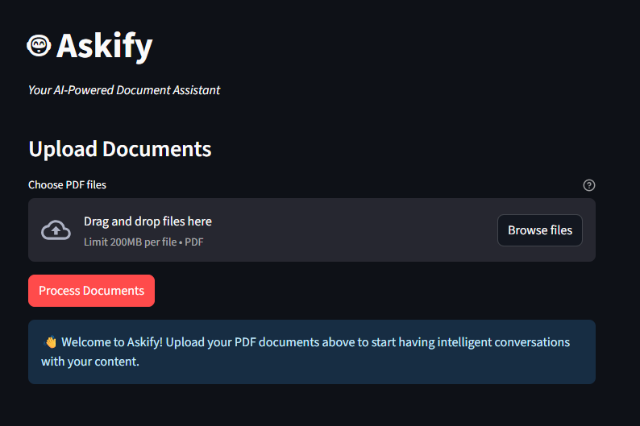
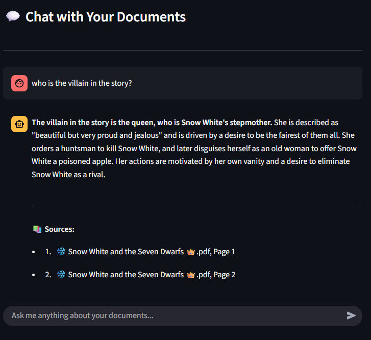

# 🤖 Askify - AI-Powered Document Assistant

Askify is a sophisticated document Q&A system that allows users to upload PDF documents and have intelligent conversations with their content using advanced RAG (Retrieval-Augmented Generation) architecture.

## ✨ Features

- **PDF Document Processing** - High-quality PDF text extraction using LlamaParse
- **Vector Search** - Semantic search using HuggingFace sentence transformers
- **Knowledge Graph** - Neo4j graph database for concept relationships
- **AI Chat Interface** - Streamlit web app with streaming responses
- **Source Citations** - References to specific pages/documents for answers
- **Multi-document Support** - Upload and query multiple PDFs simultaneously

## 📸 Screenshots

### 🔹 Before Uploading Documents


### 🔹 Chat Example After Document Processing


## 🏗️ Architecture

- **Frontend**: Streamlit web application with chat interface
- **Document Parsing**: LlamaParse API for high-quality PDF text extraction
- **Embeddings**: HuggingFace sentence-transformers (all-MiniLM-L6-v2)
- **Vector Database**: LlamaIndex for document indexing and retrieval
- **Graph Database**: Neo4j for concept relationships and enhanced context
- **LLM**: Groq API with LLaMA-3-70B model for response generation
- **NLP**: spaCy for entity extraction and relationship mapping

## 🚀 Quick Start

### Prerequisites

- Python 3.11+
- Neo4j database (cloud)
- API keys for:
  - Groq API
  - LlamaParse API

### Installation

1. Clone the repository:
```bash
git clone https://github.com/jawhar-marzougui/Askify.git
cd askify
```

2. Install dependencies:
```bash
pip install -r requirements.txt
```

3. Download spaCy model:
```bash
python -m spacy download xx_ent_wiki_sm
```

4. Set up environment variables:
```bash
copy .env.example .env
```

Edit `.env` with your actual API keys and Neo4j credentials:
```env
GROQ_API_KEY=your_groq_api_key_here
LLAMA_PARSE_API_KEY=your_llama_parse_api_key_here
NEO4J_URI=your_neo4j_uri_here
NEO4J_USER=neo4j
NEO4J_PASSWORD=your_neo4j_password_here
```

### Running the Application

```bash
streamlit run app.py
```

The application will be available at `http://localhost:8501`

## 🐳 Docker Deployment

Build and run with Docker:

```bash
# Build the image
docker build -t askify .

# Run the container
docker run -p 8501:8501 --env-file .env askify
```
docker run -p 8501:8501 --env-file .env askify
streamlit run app.py
NEO4J_PASSWORD=your_neo4j_password_here
copy .env.example .env

## 📖 Usage

1. **Upload Documents**: Use the file uploader to select one or multiple PDF files
2. **Process Documents**: Click "Process Documents" to parse and index the files
3. **Ask Questions**: Use the chat interface to ask questions about your documents
4. **Get Answers**: Receive AI-generated responses with source citations

## 🔧 Configuration

### Environment Variables

| Variable | Description | Required |
|----------|-------------|----------|
| `GROQ_API_KEY` | Groq API key for LLM access | Yes |
| `LLAMA_PARSE_API_KEY` | LlamaParse API key for PDF processing | Yes |
| `NEO4J_URI` | Neo4j database URI | Yes |
| `NEO4J_USER` | Neo4j username | Yes |
| `NEO4J_PASSWORD` | Neo4j password | Yes |

### Getting API Keys

1. **Groq API**: Sign up at [console.groq.com](https://console.groq.com)
2. **LlamaParse**: Get your key from [LlamaIndex](https://cloud.llamaindex.ai)
3. **Neo4j**: Create a free instance at [neo4j.com/aura](https://neo4j.com/aura)

## 📁 Project Structure

```
askify/
├── app.py                 # Main Streamlit application
├── parsing.py             # PDF processing utilities
├── requirements.txt       # Python dependencies
├── Dockerfile            # Docker configuration
├── .env                 # Environment variables template
├── .gitignore           # Git ignore rules
├── README.md            # Project documentation
```

## 🛠️ Development

### Key Components

- **Document Processing**: Handles PDF parsing and text extraction
- **Vector Indexing**: Creates embeddings and manages vector search
- **Graph Population**: Extracts entities and builds knowledge graph
- **Query Engine**: Combines vector search with graph insights
- **Chat Interface**: Manages conversation flow and response streaming

### Workflow

1. Documents are uploaded and parsed using LlamaParse
2. Text is split into chunks and embedded using HuggingFace models
3. Entities are extracted and stored in Neo4j graph database
4. User queries trigger both vector similarity search and graph traversal
5. LLM generates responses using retrieved context and graph insights
6. Responses are streamed to the user with source citations

## 🤝 Contributing

1. Fork the repository
2. Create a feature branch
3. Make your changes
4. Add tests if applicable
5. Submit a pull request

## 📄 License

This project is licensed under the MIT License - see the LICENSE file for details.

## 🙏 Acknowledgments

- [LlamaIndex](https://www.llamaindex.ai/) for the RAG framework
- [Streamlit](https://streamlit.io/) for the web interface
- [Neo4j](https://neo4j.com/) for graph database capabilities
- [Groq](https://groq.com/) for fast LLM inference
